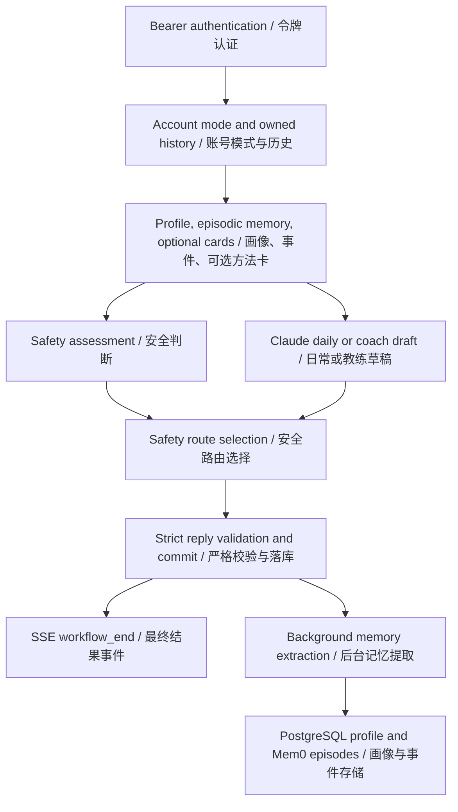

# 架构与适配说明 / Architecture and adaptation notes

## 范围 / Scope

本项目提供独立的心理支持文字服务，包括日常支持和心理教练两种模式。公开交付仅包含代码、提示词、空配置模板、测试与文档。

This project provides standalone psychological-support text services in everyday-support and coaching modes. The public distribution contains only code, prompts, empty configuration templates, tests, and documentation.

身份服务、前端代理、计费和运维系统由部署者独立集成。公开包不提供既有部署的标识、来源文件指纹、环境信息或用户数据。

Deployers integrate identity, frontend proxies, billing, and operations separately. The public package does not provide existing-deployment identifiers, source-file fingerprints, environment information, or user data.

## 处理流程 / Request flow

安全判断与主回复生成保留并行执行。非普通支持路由返回安全回复，抑制该轮普通记忆写入。安全状态、精确原文证据校验、跨会话纠正和检索后的记忆采用规则来自生产实现。两个主模式只在主提示词上区分，账号模式每轮从数据库读取。

Safety assessment and draft generation remain parallel. Non-support routes select safety replies and suppress ordinary memory writes for that turn. Active safety state, exact-quote checks, cross-session corrections, and rules for using retrieved memory are derived from production. The two main modes differ in their main system prompts; account mode is read from the database each turn.

| 角色 / Role | 快照配置 / Snapshot configuration |
|---|---|
| 主回复 / Main reply | `openrouter` · `anthropic/claude-sonnet-5` |
| 安全判断 / Safety assessment | `deepseek` · `deepseek-v4-flash` |
| 后台记忆提取 / Background memory extraction | `ark` · `doubao-seed-2-1-turbo-260628` |
| Embedding | SiliconFlow · `BAAI/bge-m3`, 1024 dimensions |
| 事件存储 / Episodic storage | Mem0 OSS + Qdrant, `infer=False` |

这些标识忠实保留快照的配置，不保证公开服务账号均有权限。供应商适配层改为通用公开端点，由使用者填入自己的凭证；本次没有用真实模型完成端到端验证。

These identifiers preserve the snapshot configuration, not an assurance of access for every public provider account. The transport adapter now uses public endpoints and recipient-provided credentials. Live-model end-to-end validation was not performed for this release.

## 开源适配改动 / Adaptation changes

| 内容 / Area | 差异 / Difference |
|---|---|
| 文字模式 / Modes | 仅保留 `claude`、`claude_coach`；删除旧 `production` 分支、reviewer 回复改写和模型失败回退。Only the two Claude modes remain; retired reply paths and silent fallback are removed. |
| 认证 / Authentication | 使用随机独立账号令牌及数据库哈希；不带生产用户、微信凭证或会话。Standalone random account tokens and hashes replace production identity integrations. |
| API | 用受认证的独立文字接口替代业务中间件；不暴露内部安全原句、RAG 查询或记忆检索结果。Authenticated standalone endpoints replace business middleware and omit internal diagnostic payloads. |
| 提示词 / Prompts | 原文抽成独立文件，增加单独译文；运行时语言保持原样。Original prompts are extracted into files with separate translations; runtime language is unchanged. |
| Mem0 | 保留 OSS 路径，移除云端旧路径及其凭证文件依赖。The active OSS path remains; retired hosted-Mem0 credentials and paths are removed. |
| 数据 / Data | 提供空表、68 张方法卡和导入器；用户数据不随包交付。Empty schema, 68 method cards, and an importer; no user data. |
| 事务 / Transactions | 开源适配使用真实事务，使已有行锁有效；存储失败不发成功终态。Transactions make existing row locks effective; failed storage does not emit a successful terminal event. |
| 删除顺序 / Reset ordering | 单 worker 全局锁协调请求、记忆写入和清空；清空使等待中的旧记忆任务失效，事件写入保持在锁内。A single-worker lock coordinates requests, memory writes, and reset; reset invalidates queued old writes. |
| 日志 / Logs | 移除正文诊断上报、解析错误原文和带上游正文的异常；不复制线上日志。Raw-output diagnostics and raw exception payloads are removed; no production logs are included. |
| 问候 / Greeting | 独立接口返回通用确定性问候，不包含生产问候服务的业务逻辑。A deterministic generic greeting replaces the separate production greeting service. |

主回复仍是完整生成后发 SSE 结果。长度截断仍只重试一次，预算 1600 → 3200；再次截断失败，不保存残缺助手回复。JSON 字段名保持英文协议值，`audio` 恒为 `none`，没有音频附件或媒体依赖。

The final reply is emitted through SSE after complete generation. A length-truncated reply is regenerated once with budget 1600 → 3200; another truncation fails without saving an incomplete assistant reply. JSON field names remain protocol identifiers. `audio` is always `none`, with no audio assets or media dependencies.

## 保留的局限 / Retained limitations

单进程适配锁会让不同账号的请求串行；适合开发、审查和小规模使用，不代表高并发生产架构。后台线程不是持久任务队列。安全和主回复并行时，主回复失败可能使整轮以错误结束，即便安全判断已经完成；这里没有声称改善或证明了生产安全效果。运行在中国大陆语境的中文安全话术也没有全球本地化。

The process-wide adapter lock serializes requests across accounts. This suits development, review, and small deployments, not a high-concurrency production claim. Background threads are not durable jobs. Because safety and generation run in parallel, a generation failure may end the whole turn with an error even if triage completed. No improved or validated clinical safety outcome is claimed. Chinese safety wording retains its mainland-China context and is not globally localized.
